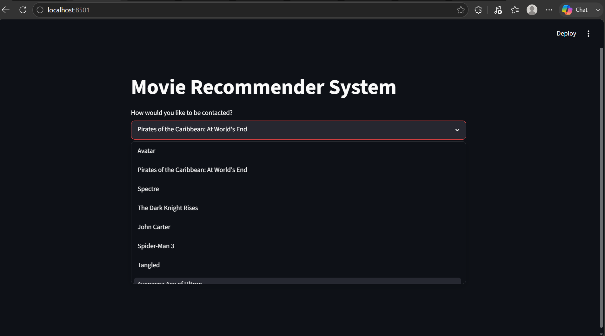

# 🎬 Movie Recommender System

A Content-Based Movie Recommendation System built using Natural Language Processing (NLP) and Machine Learning techniques. The system recommends movies similar to a selected movie by analyzing movie metadata such as genres, cast, crew, keywords, and plot overviews.

---

## 🚀 Features

* Content-Based Filtering
* Natural Language Processing (NLP)
* Text Preprocessing and Stemming
* Bag of Words Vectorization
* Cosine Similarity-Based Recommendations
* Interactive Streamlit Web Application
* Top-5 Similar Movie Recommendations

---

## 📊 Dataset

TMDB 5000 Movie Dataset

Source:

https://www.kaggle.com/datasets/tmdb/tmdb-movie-metadata

Files Used:

* tmdb_5000_movies.csv
* tmdb_5000_credits.csv

Dataset Size:

* 4,800+ movies
* Movie metadata including genres, cast, crew, keywords, and overviews

---

## 🛠️ Tech Stack

* Python
* Pandas
* NumPy
* Scikit-Learn
* NLTK
* Streamlit

---

## 📌 Project Workflow

### 1. Data Collection

Loaded movie metadata and credits datasets from TMDB.

### 2. Data Preprocessing

* Removed missing values
* Merged movie and credits datasets
* Selected relevant features
* Extracted director information
* Extracted top cast members
* Processed genres and keywords

### 3. Feature Engineering

Created a combined `tags` feature using:

* Overview
* Genres
* Keywords
* Cast
* Crew

### 4. Text Processing

Applied:

* Lowercasing
* Tokenization
* Stemming using Porter Stemmer

### 5. Vectorization

Converted movie tags into numerical vectors using:

```python
CountVectorizer(max_features=5000, stop_words='english')
```

Generated:

* 4,806 movie vectors
* 5,000-dimensional feature space

### 6. Similarity Calculation

Calculated movie similarity using:

```python
cosine_similarity()
```

Generated a similarity matrix of shape:

```text
(4806, 4806)
```

### 7. Recommendation Generation

Generated Top-5 movie recommendations based on cosine similarity scores.

---

## 📈 Results

* Processed 4,800+ movies
* Generated 5,000-dimensional feature vectors
* Built a similarity matrix using cosine similarity
* Developed a recommendation engine capable of suggesting similar movies
* Integrated the recommendation engine into a Streamlit application

---

## 🖥️ Application Preview

### Movie Selection Interface



### Recommendation Results


---

## 🎯 Sample Recommendation

### Input

```text
Batman Begins
```

### Output

```text
The Dark Knight
Batman
The Dark Knight Rises
10th & Wolf
```

---

## 📂 Project Structure

```text
movie-recommender-system/
│
├── app.py
├── create_model.py
├── movie_recommender.ipynb
├── movie_dict.pkl
├── README.md
├── requirements.txt
│
└── images/
    ├── movie_selection.png
    └── recommendations.png
```

---

## ▶️ Running the Project

Install dependencies:

```bash
pip install -r requirements.txt
```

Run the application:

```bash
streamlit run app.py
```

---

## ⚠️ Important Note

The file `similarity.pkl` is not included in this repository because its size exceeds GitHub's web upload limits.

To regenerate the similarity matrix locally:

```bash
python create_model.py
```

This script performs:

* Data preprocessing
* Feature engineering
* Text vectorization
* Cosine similarity computation
* Pickle file generation

---

## 🔮 Future Improvements

* Movie poster integration using TMDB API
* Hybrid recommendation system
* Personalized user recommendations
* Deployment on Streamlit Cloud
* Improved recommendation ranking

---

## 👩‍💻 Author

**Pratishtha Garg**

Machine Learning Enthusiast | NLP | Recommendation Systems
